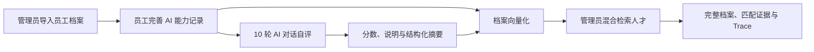
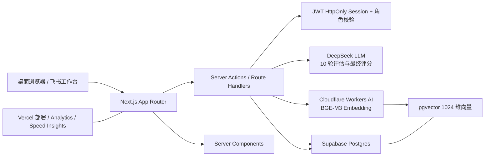

<div align="center">

# AI Talent

### 企业 AI 人才评估与管理系统

让员工持续沉淀 AI 能力档案，通过 AI 多轮自评形成可比较的评估结果，并帮助管理员快速发现适合项目的人才。

[](https://github.com/335691851/AI-Talent01/actions/workflows/ci.yml)


</div>


**快速导航：** [核心能力](#核心能力) · [产品界面](#产品界面) · [总体架构](#总体架构) · [本地启动](#五分钟本地启动) · [质量检查](#质量检查) · [详细文档](#文档导航)

## 项目简介

AI Talent 是面向单一企业的轻量级 AI 人才信息系统。系统围绕“档案沉淀、员工自评、人才检索”形成闭环：

1. 管理员通过 Excel 初始化员工基础信息，员工登录后维护自己的 AI 能力记录。
2. 员工在 Chatbox 中完成 10 轮 AI 能力自评，系统生成百分制分数、评估说明和结构化摘要。
3. 档案与最新评估结果通过 Cloudflare Workers AI `@cf/baai/bge-m3` 生成向量并写入 Supabase pgvector。
4. 管理员使用结构化条件与语义相似度混合检索企业人才，并查看可展开的完整检索 Trace。

系统只有两种角色，不包含租户、部门树或复杂组织权限：

| 角色 | 主要能力 |
| --- | --- |
| 管理员 | 企业概览、员工档案管理、Excel 导入、人才检索、系统与向量化状态查看 |
| 员工 | 查看和编辑本人档案、发起多次 AI 自评、查看本人全部历史评估结果 |



## 核心能力

| 模块 | 已实现能力 |
| --- | --- |
| 企业人才概览 | 员工总量、档案完整度、平均 AI 分数、高潜人才、分数区间、能力关键词分布 |
| 员工 AI 档案 | 工号、姓名、手机号、邮箱、岗位、岗位描述、级别、产品能力、技术栈、项目经验 |
| Excel 批量导入 | 固定模板、表头识别、必填校验、工号覆盖更新、手机号冲突校验、逐行错误与成功/失败统计 |
| AI 自评估 | 员工本人发起、10 轮流式对话、百分制评分、长文本说明、结构化摘要、历史结果 |
| 人才检索 | 关键词匹配、最低分过滤、BGE-M3 query embedding、pgvector 余弦检索、结果合并与证据展示 |
| 检索 Trace | 请求标识、调用角色、输入参数、Embedding 模型、RPC、阈值、候选数、结果数、耗时事件 |
| 向量化 | 档案保存/导入/评估完成后增量更新，全量 backfill，按项目或年份拆分项目经验 chunk |
| 登录与权限 | 账号密码登录、飞书工作台自动免登、JWT HttpOnly Session、管理员/员工双角色校验 |
| 安全控制 | 业务表 RLS、浏览器角色撤权、service role 服务端访问、Chat API 校验评估会话与员工身份 |

## 产品界面

<table>
  <tr>
    <td width="50%">
      
      <p align="center"><strong>Excel 员工导入</strong><br/>模板、校验规则和导入结果在同一页面完成反馈。</p>
    </td>
    <td width="50%">
      
      <p align="center"><strong>员工 AI 自评估</strong><br/>10 轮 Chatbox、进度、历史记录和最终评估结果。</p>
    </td>
  </tr>
  <tr>
    <td width="50%">
      
      <p align="center"><strong>管理员人才检索</strong><br/>完整档案、匹配原因、证据片段和评估摘要。</p>
    </td>
    <td width="50%">
      
      <p align="center"><strong>实施配置总览</strong><br/>服务配置状态、向量覆盖率与安全边界集中展示。</p>
    </td>
  </tr>
</table>

> 截图使用专用测试数据，不包含真实员工资料。

## 总体架构



更完整的组件边界、时序图、数据模型和混合检索规则见 [系统架构](docs/architecture.md)。

## 技术栈

| 层级 | 技术 |
| --- | --- |
| Web | Next.js App Router、React、TypeScript、Tailwind CSS、Lucide Icons |
| AI 交互 | Vercel AI SDK、流式文本响应、Zod 请求校验 |
| LLM | DeepSeek OpenAI-compatible API，默认模型 `deepseek-v4-flash` |
| Embedding | Cloudflare Workers AI，默认模型 `@cf/baai/bge-m3`，1024 维 |
| 数据库 | Supabase Postgres、pgvector、Postgres RPC、RLS |
| 文件导入 | `read-excel-file`、`write-excel-file` |
| 认证 | bcrypt、JOSE JWT、HttpOnly Cookie、飞书 OAuth |
| 部署与观测 | Vercel、Web Analytics、Speed Insights |
| 测试与 CI | Vitest、Playwright、ESLint、GitHub Actions |

## 五分钟本地启动

### 1. 环境要求

- Node.js 24.x（与 GitHub Actions 保持一致）
- npm
- Supabase 项目和 Postgres 连接串
- 完整 AI 能力还需要 DeepSeek API Key 与 Cloudflare Workers AI 凭据

### 2. 安装与配置

```powershell
npm install
Copy-Item .env.example .env.local
```

编辑 `.env.local`，至少完成 Supabase 与 `AUTH_SECRET` 配置。不要提交 `.env.local`，不要把 service role、LLM Key 或飞书 App Secret 暴露到浏览器变量中。

### 3. 初始化数据库

```powershell
npm.cmd run db:push
```

该命令按文件名顺序执行 `supabase/migrations/`，创建业务表、`vector` 扩展、索引、RPC 与 RLS/撤权规则。

### 4. 启动应用

```powershell
npm.cmd run dev
```

打开 `http://localhost:3000`。生产或团队环境必须自行设置安全的管理员密码和员工初始密码，本仓库不提供公共演示凭据。

### 5. 全量重建向量（可选）

```powershell
npm.cmd run embeddings:backfill
```

该脚本会先生成全部向量，成功后在单个数据库事务中重写 `employee_embeddings`。详细步骤见 [配置与部署](docs/setup-and-deployment.md)。

## 质量检查

```powershell
npm.cmd run lint
npm.cmd test
npm.cmd run test:e2e
npm.cmd run build
```

针对 `master` 的 Pull Request 会运行 GitHub Actions，执行 ESLint 和 Vitest。

## 文档导航

| 文档 | 内容 |
| --- | --- |
| [系统架构](docs/architecture.md) | 模块边界、AI 自评时序、混合检索、Embedding、pgvector、数据模型与 Trace |
| [配置与部署](docs/setup-and-deployment.md) | 环境变量、本地启动、数据库初始化、向量重建、Vercel 部署与故障排查 |
| [安全与认证](docs/security-and-auth.md) | 角色、Session、RLS、服务端数据访问、评估隐私、飞书免登与加固清单 |
| [测试方案](docs/testing-plan.md) | Vitest、Playwright、数据库与手工验收用例设计 |
| [本地测试报告 v1.0](docs/testing-report-v1.0.md) | 本地功能与自动化测试结果 |
| [生产测试报告 v1.0](docs/production-test-report-v1.0-20260702.md) | 指定版本的生产检查快照、数据核验与限制项 |

## 当前能力边界

- 面向单一企业，不实现多租户和部门级管理。
- 仅支持管理员与员工两类角色。
- 以桌面端企业信息系统为目标，不提供移动端专项适配。
- 员工可多次发起评估并查看自己的历史结果；管理员只使用员工最新有效结果，不查看完整对话。
- 人才检索当前完成结构化与语义召回、阈值过滤、证据展示和 Trace，尚未加入 LLM 重排或生成式回答。
- Cloudflare Embedding 未配置或调用失败时，人才检索自动降级为结构化检索。

## 项目目录

```text
src/app/                 Next.js 页面、Server Actions 与 Route Handlers
src/components/          业务组件与基础 UI
src/lib/ai/              DeepSeek 与 Embedding 适配
src/lib/auth/            Session 与飞书 OAuth
src/lib/db/              Supabase 查询、评估、检索与权限逻辑
src/lib/import/          Excel 解析与校验
supabase/migrations/     数据库结构、pgvector、RPC 与安全迁移
scripts/                 数据库初始化与全量向量重建脚本
docs/                    架构、部署、安全、测试与业务截图
.github/workflows/       Pull Request 质量检查
```

---

AI Talent 当前用于企业内部 AI 人才档案、评估和检索场景。仓库暂未声明开源许可证，使用和分发前请确认项目所有者的授权范围。
