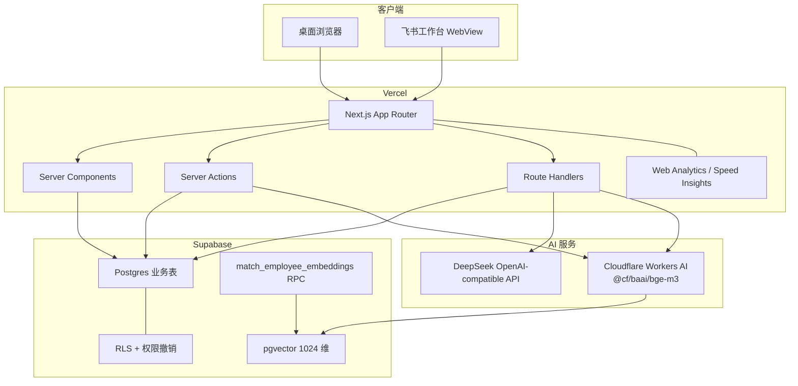
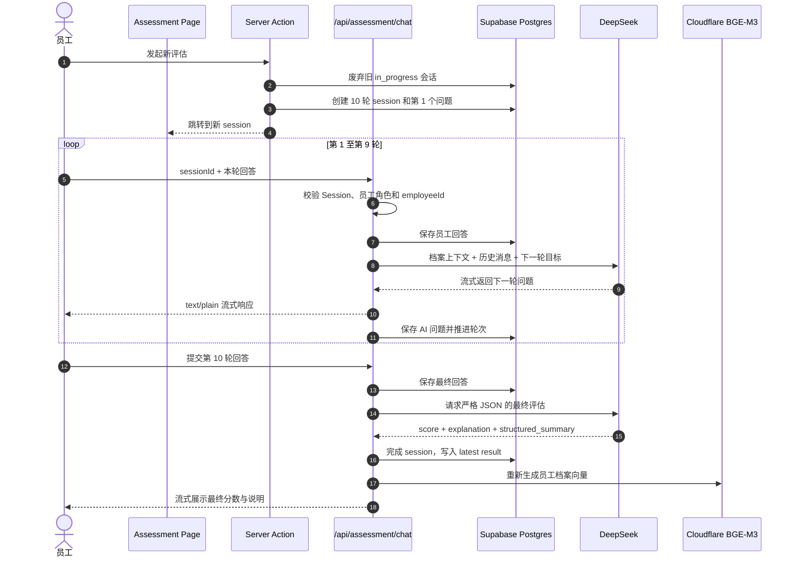
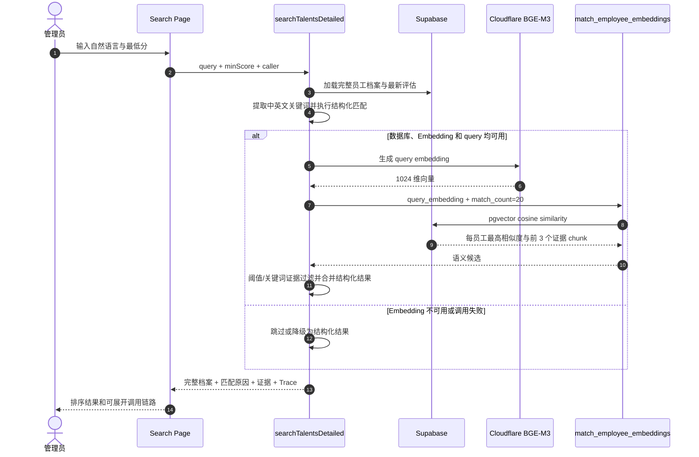

# AI Talent 系统架构

本文面向开发者和技术维护人员，描述 AI Talent 当前代码版本的组件边界、数据流、AI 调用链路、向量检索策略和数据模型。

## 1. 架构目标

AI Talent 服务于单一企业的 AI 人才档案与评估场景，核心设计原则是：

- 业务数据和密钥仅在服务端访问。
- 管理员和员工使用同一套应用，但页面、数据范围和接口权限不同。
- AI 评估和人才检索相互独立，通过最新有效评估结果和员工档案汇合。
- Embedding 服务不可用时不阻断档案维护，人才检索可降级为结构化匹配。
- 管理员可以查看检索 Trace，但不能查看员工完整评估对话。

## 2. 系统边界



### 2.1 Next.js 层

| 模块 | 职责 |
| --- | --- |
| Server Components | 获取当前 Session、执行页面级角色跳转、读取数据库并生成首屏 HTML |
| Server Actions | 登录、退出、员工档案保存、评估任务创建、管理员向量化操作 |
| Route Handlers | Excel 上传/模板下载、AI 流式响应、飞书 OAuth start/callback |
| Client Components | 表单交互、抽屉、Chatbox、上传进度、检索 Trace 展开与结果展示 |

### 2.2 外部服务

| 服务 | 用途 | 不可用时行为 |
| --- | --- | --- |
| Supabase Postgres | 业务数据、评估消息、结果、向量和导入记录 | 真实业务不可用；未配置数据库时仅保留有限本地演示登录 |
| DeepSeek | 评估下一轮问题和最终评分说明 | 未配置时使用确定性的演示问题与演示评分 |
| Cloudflare Workers AI | 档案和查询文本的 BGE-M3 Embedding | 跳过向量写入；人才检索降级为结构化匹配 |
| 飞书开放平台 | 工作台 OAuth 免登并获取当前用户手机号 | 登录页显示明确错误，可回退到账号密码登录 |

## 3. 页面与角色

| 路径 | 管理员 | 员工 | 说明 |
| --- | :---: | :---: | --- |
| `/` | 是 | 自动转到 `/assessment` | 企业人才概览 |
| `/employees` | 全部员工 | 仅本人 | 员工档案列表、详情抽屉与编辑 |
| `/assessment` | 无业务入口 | 是 | 10 轮 AI 自评和历史结果 |
| `/search` | 是 | 否 | 混合人才检索与 Trace |
| `/imports` | 是 | 否 | Excel 模板和批量导入 |
| `/settings` | 是 | 否 | 服务配置、向量化进度和安全边界 |
| `/login` | 是 | 是 | 账号密码登录；飞书环境自动进入 OAuth |

最终授权不依赖导航是否显示，而是在页面、Server Action 和 Route Handler 内再次执行 Session 与角色检查。

## 4. 员工档案与导入链路

员工档案由两个核心表组合：

- `employees`：工号、姓名、手机号、邮箱、岗位、岗位描述和级别。
- `employee_ai_profiles`：产品能力、技术栈能力、项目经验和档案完整度。

管理员上传 Excel 后，服务端执行：

1. 解析工作簿并识别固定表头。
2. 对工号、姓名和手机号执行必填校验。
3. 使用工号作为业务唯一标识执行 upsert。
4. 拒绝“同一手机号属于另一个工号”的记录。
5. 创建或更新 AI 档案。
6. 手机号尚无账号时，创建员工账号并写入 bcrypt 密码哈希。
7. 尝试为该员工生成最新 Embedding；失败只记录日志，不回滚已成功导入的档案。
8. 返回总数、成功数、失败数和逐行错误。

员工或管理员编辑单份档案时使用同样的档案写入与增量向量化逻辑。员工必须满足 `session.employeeId === employeeId`。

## 5. AI 自评估链路

### 5.1 业务规则

- 只有员工本人可以发起和访问评估会话。
- 每个新任务创建时，员工此前仍为 `in_progress` 的会话会被标记为 `abandoned`。
- 默认总轮数由 `AI_ASSESSMENT_TOTAL_ROUNDS` 控制，当前默认值为 10。
- 完成最后一轮回答后才生成有效结果。
- 每次完成结果都会把该员工旧结果的 `is_latest` 设为 `false`，新结果设为 `true`。
- 员工可以查看自己的历史结果；管理员业务页面只使用最新有效结果。
- 最终评估完成后重新生成该员工向量，使人才检索包含最新评估证据。

### 5.2 时序图



### 5.3 DeepSeek 调用

应用通过 `@ai-sdk/openai-compatible` 创建 DeepSeek provider，并由 Vercel AI SDK：

- `streamText` 生成非最终轮次问题。
- `generateText` 生成最终评估 JSON。
- `parseEvaluationJson` 将模型输出规范为百分制分数、长文本说明和结构化摘要。

`/api/assessment/chat` 接受的消息长度为 1 至 6000 字符，Route Handler 最大执行时间为 60 秒，响应使用 `text/plain` 流。

## 6. Embedding 数据设计

### 6.1 向量模型

默认模型为 Cloudflare Workers AI `@cf/baai/bge-m3`，向量维度为 1024。数据库列类型固定为 `vector(1024)`，修改模型或维度时必须同步修改：

- `CLOUDFLARE_EMBEDDING_DIMENSIONS`
- `employee_embeddings.embedding`
- `match_employee_embeddings` 的参数签名
- 向量索引与安全 migration

### 6.2 Chunk 类型

| `chunk_type` | 内容来源 | 分块方式 |
| --- | --- | --- |
| `profile` | 岗位、岗位描述、级别 | 合并后每 900 字符切分 |
| `product_ability` | 产品能力 | 每 900 字符切分 |
| `technical_ability` | 技术栈能力 | 每 900 字符切分 |
| `project_experience` | 项目经验 | 优先按 `20xx年` 项目起始拆分，否则按空行拆分，再限制 900 字符 |
| `latest_assessment` | 最新分数、评估说明、结构化摘要 | 最新有效结果组成单块，超长时当前实现不再二次切分 |

增量向量化在写入前删除该员工旧 chunk，再插入本次完整 chunk 集合。全量 backfill 则先生成所有向量，全部成功后在单个事务内清空并重写向量表，避免生成过程中产生半完成数据。

## 7. 人才混合检索

当前人才检索是“结构化匹配 + 向量语义召回 + 证据合并”，不包含 LLM 重排和生成式回答。



### 7.1 结构化匹配

检索范围包括姓名、工号、手机号、邮箱、岗位、岗位描述、级别、产品能力、技术能力、项目经验、最新评估说明和结构化摘要。

中文查询会移除常见意图填充词，并生成 2 至 4 字的片段；英文、数字和技术符号按 token 提取。命中词用于计算匹配分并生成证据片段。

### 7.2 语义过滤

- RPC 当前最多返回 20 名候选员工。
- 基础语义阈值为 `max(RAG_MIN_SCORE, 0.45)`。
- 强语义阈值为 `max(基础阈值 + 0.2, 0.68)`。
- 查询包含可提取关键词时，候选必须满足“证据包含关键词”或“相似度达到强阈值”。
- 查询没有可提取关键词时，候选必须达到基础阈值。
- 最终匹配分取结构化匹配分、评估分和语义相似度分中的适用高值，并按降序展示。

### 7.3 Trace

每次管理员检索生成独立 `requestId`，Trace 包含：

- 调用页面、角色与用户名。
- 原始查询、最低分、抽取词、候选数和阈值。
- 数据库、Embedding 配置状态、模型、维度、RPC 名称。
- 结构化命中数、语义候选数、语义接受数和最终结果数。
- query embedding、RPC、合并、降级等事件的状态与相对耗时。

Trace 不记录服务端密钥，也不向员工开放管理员检索能力。

## 8. pgvector RPC

`match_employee_embeddings(query_embedding vector(1024), match_count int)` 使用余弦距离操作符 `<=>`：

1. 对每个 chunk 计算 `1 - cosine_distance`。
2. 对每个员工按距离排序并取最高相似度。
3. 全局选择前 `match_count` 名员工。
4. 为每名员工聚合排名最前的 3 个 chunk 作为 evidence。

向量表使用 `ivfflat` 与 `vector_cosine_ops` 索引。RPC 的 `search_path` 固定为 `public`，执行权限仅授予 `service_role`。

## 9. 数据模型

```mermaid
erDiagram
    EMPLOYEES ||--o| APP_USERS : "绑定登录账号"
    EMPLOYEES ||--|| EMPLOYEE_AI_PROFILES : "拥有 AI 档案"
    EMPLOYEES ||--o{ ASSESSMENT_SESSIONS : "发起评估"
    ASSESSMENT_SESSIONS ||--o{ ASSESSMENT_MESSAGES : "包含对话"
    ASSESSMENT_SESSIONS ||--o| ASSESSMENT_RESULTS : "生成结果"
    EMPLOYEES ||--o{ ASSESSMENT_RESULTS : "拥有历史结果"
    EMPLOYEES ||--o{ EMPLOYEE_EMBEDDINGS : "拆分向量块"
    IMPORT_BATCHES ||--o{ IMPORT_ROWS : "包含导入行"
    APP_USERS ||--o{ IMPORT_BATCHES : "执行导入"

    EMPLOYEES {
        uuid id PK
        text employee_no UK
        text name
        text phone UK
        text email
        text position
        text position_description
        text level
    }
    APP_USERS {
        uuid id PK
        uuid employee_id FK
        text username UK
        text phone UK
        text password_hash
        user_role role
        user_status status
    }
    EMPLOYEE_AI_PROFILES {
        uuid employee_id PK_FK
        text product_ability
        text technical_ability
        text project_experience
        int profile_completion
    }
    ASSESSMENT_SESSIONS {
        uuid id PK
        uuid employee_id FK
        assessment_status status
        int current_round
        int total_rounds
    }
    ASSESSMENT_MESSAGES {
        uuid id PK
        uuid session_id FK
        int round_no
        message_role role
        text content
    }
    ASSESSMENT_RESULTS {
        uuid id PK
        uuid session_id UK_FK
        uuid employee_id FK
        int score
        text assessment_explanation
        jsonb structured_summary
        boolean is_latest
    }
    EMPLOYEE_EMBEDDINGS {
        uuid id PK
        uuid employee_id FK
        text chunk_type
        text content
        vector embedding
    }
    IMPORT_BATCHES {
        uuid id PK
        uuid imported_by FK
        text file_name
        int total_rows
        int success_rows
        int failed_rows
    }
    IMPORT_ROWS {
        uuid id PK
        uuid batch_id FK
        int row_no
        text employee_no
        jsonb raw_data
        text status
        text error_message
    }
```

## 10. 一致性与降级策略

| 场景 | 当前策略 |
| --- | --- |
| 档案保存成功、Embedding 失败 | 保留档案，记录 warning；后续可用设置页或 backfill 补齐 |
| Excel 部分行失败 | 成功行继续写入，返回逐行失败信息 |
| 语义检索失败 | 返回结构化检索结果，并在 Trace 中记录 `structured-fallback` |
| DeepSeek 未配置 | 非生产演示流程使用确定性问题和结果，保证 UI 可测试 |
| 新评估覆盖进行中评估 | 旧 session 标记 `abandoned`，不生成结果 |
| 无效或过期 Session | 页面重定向登录；接口返回对应拒绝或错误 |

## 11. 相关文档

- [返回 README](../README.md)
- [配置与部署](setup-and-deployment.md)
- [安全与认证](security-and-auth.md)
- [测试方案](testing-plan.md)
