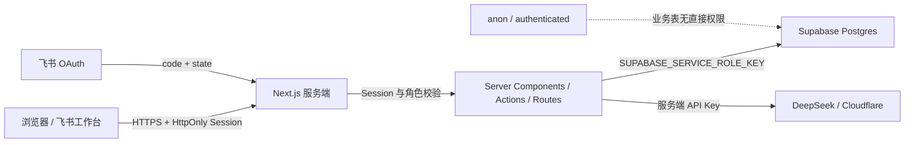
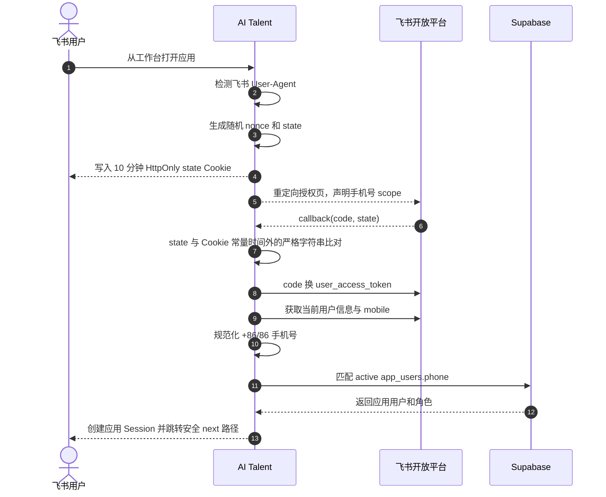

# AI Talent 安全与认证

本文描述 AI Talent 当前实现的身份认证、角色授权、数据库访问、评估隐私和飞书免登安全机制，并列出生产环境需要持续加固的事项。

## 1. 信任边界



当前系统采用 Backend-for-Frontend 模式：浏览器不直接查询 Supabase 业务表，所有业务访问经过 Next.js 服务端。Supabase service role 可以绕过 RLS，因此 Next.js 的 Session、角色检查和数据归属检查是主要业务授权边界。

## 2. 角色模型

系统只有两个角色：

| 能力 | 管理员 | 员工 |
| --- | :---: | :---: |
| 查看企业人才概览 | 是 | 否，访问首页会转到自评页 |
| 查看全部员工档案 | 是 | 否 |
| 查看本人档案 | 是 | 是 |
| 编辑任意员工档案 | 是 | 否 |
| 编辑本人档案 | 是 | 是 |
| Excel 导入和模板下载 | 是 | 否 |
| 发起 AI 自评 | 否 | 是，仅本人 |
| 查看本人全部历史评估结果 | 否 | 是 |
| 查看员工最新评估结果与摘要 | 是 | 仅本人 |
| 查看完整评估对话 | 否 | 是，仅本人当前/历史会话接口允许范围内 |
| 人才检索和 Trace | 是 | 否 |
| 查看系统配置与向量化状态 | 是 | 否 |

授权检查分布在：

- 页面 Server Component：未登录跳转，员工与管理员页面分流。
- Server Action：`requireSession()` 或 `requireRole("admin")`。
- Route Handler：导入接口、模板接口、AI Chat 和飞书回调分别校验。
- 对象归属：员工档案和评估会话比较 `session.employeeId` 与目标 `employeeId`。

导航隐藏不是授权手段，服务端检查才是最终边界。

## 3. 账号密码认证

### 3.1 账号数据

`app_users` 保存：

- 可选管理员用户名或员工手机号。
- bcrypt `password_hash`，不保存明文密码。
- `admin` / `employee` 角色。
- `active` / `disabled` 状态。
- 可选的 `employee_id` 档案关联。

登录时：

1. 按用户名或手机号查找账号。
2. 拒绝不存在或 `disabled` 的账号。
3. 使用 bcrypt 比较密码哈希。
4. 生成应用自己的 JWT Session。

员工通过 Excel 导入或管理员创建档案时，如手机号尚无账号，系统使用 `DEFAULT_EMPLOYEE_PASSWORD` 生成 bcrypt 哈希。生产环境必须按企业密码策略设置该变量，并规划首次登录改密能力；当前版本没有强制首次改密流程。

### 3.2 本地演示回退

数据库未配置时，登录 Action 支持环境变量定义的本地管理员用于原型演示。生产环境必须配置数据库并设置强随机 `AUTH_SECRET`，不得依赖演示回退。

## 4. Session 机制

应用使用 JOSE 生成 HS256 JWT，并写入名为 `ai_talent_session` 的 Cookie。

| 属性 | 当前值 |
| --- | --- |
| `httpOnly` | `true`，客户端 JavaScript 无法读取 |
| `sameSite` | `lax` |
| `secure` | 生产环境 `true` |
| `path` | `/` |
| 有效期 | 7 天 |
| 签名 | `AUTH_SECRET` + HS256 |

Token 载荷包含用户 ID、角色、用户名、手机号、员工 ID 和显示名称，不包含密码或外部 API Key。

### 当前限制

- Session 是无状态 JWT，没有服务端 Session 表和主动吊销列表。
- 用户被设为 `disabled` 后，已经签发的 Token 当前不会每次请求都重新查询账号状态，最长可能持续到 Token 过期。
- 角色变更同样不会自动使旧 Token 立即失效。

需要更严格的离职/禁用实时生效时，应增加 Session 版本号、服务端 Session 存储或请求期账号状态复核。

## 5. 飞书工作台免登

### 5.1 自动识别

登录页在服务端检查 User-Agent 是否包含 `feishu` 或 `lark`。满足以下条件时自动进入 OAuth：

- 飞书 App ID 和 App Secret 已配置。
- 当前请求没有 `feishu_error`，避免失败后循环重定向。
- 请求来自飞书/Lark 环境。

客户端组件保留相同检测作为静默兜底，页面不提供手动飞书登录按钮。

### 5.2 OAuth 流程



已实现的保护：

- `state` 包含 24 字节随机 nonce，Base64URL 编码。
- state 同时保存到 `HttpOnly`、`SameSite=Lax`、生产 `Secure` Cookie，有效期 10 分钟。
- callback 要求查询参数 state 与 Cookie 完全一致，并在读取后删除 Cookie。
- `next` 只接受以 `/` 开头的站内路径，其他值回退 `/`，降低开放重定向风险。
- OAuth 授权显式声明 `contact:user.phone:readonly`。
- App Secret 和 user access token 只在 Node.js Route Handler 中处理。
- 手机号只匹配 `active` 账号。

### 5.3 手机号身份边界

飞书返回的手机号来自企业通讯录，系统将其作为与内部账号关联的 key。需要注意：

- 员工档案手机号必须与飞书通讯录保持一致。
- 手机号变更需要同步更新 `employees.phone` 与 `app_users.phone`。
- 数据库对两处手机号分别设置唯一约束，但业务操作仍需避免产生员工和账号关联不一致。
- 正式企业应建立通讯录手机号变更和离职账号禁用流程。

## 6. 数据库访问与 RLS

### 6.1 当前策略

以下业务表均启用 RLS：

- `employees`
- `app_users`
- `employee_ai_profiles`
- `assessment_sessions`
- `assessment_messages`
- `assessment_results`
- `employee_embeddings`
- `import_batches`
- `import_rows`

Migration 还执行：

- 撤销 `anon` 和 `authenticated` 对所有业务表的全部权限。
- 撤销 public、`anon`、`authenticated` 对向量 RPC 的执行权限。
- 只授予 `service_role` 执行 `match_employee_embeddings`。
- 固定 RPC 的 `search_path = public`。

当前没有为浏览器角色创建 allow policy，因此 Supabase Security Advisor 可能显示 `RLS Enabled No Policy`。在本项目的服务端访问模式下，这是“浏览器默认拒绝”的设计结果，不代表浏览器应获得访问策略。

### 6.2 service role 风险

`SUPABASE_SERVICE_ROLE_KEY` 会绕过 RLS。安全要求：

- 只能在 Server Components、Server Actions、Route Handlers 和受控脚本中读取。
- 绝不能添加 `NEXT_PUBLIC_` 前缀。
- 绝不能记录到日志、错误页面或 Trace。
- Preview 环境不应无条件共享生产 service role。
- 所有使用 service role 的入口必须先完成应用 Session、角色和对象归属校验。

## 7. AI 评估隐私

完整评估对话存储在 `assessment_messages`。当前保护包括：

- Chat API 必须有有效 Session。
- 只有 `employee` 角色可调用。
- `user.employeeId` 必须等于目标评估会话的 `employeeId`。
- 管理员页面不查询或展示 `assessment_messages.content`。
- 管理员档案和人才检索只使用最新有效分数、评估说明和结构化摘要。
- Embedding 只写入最新评估结果，不把完整多轮对话写入向量表。

service role 和数据库管理员从基础设施层仍有能力读取表数据，因此数据库访问权限、审计和备份权限必须由运维侧控制。

## 8. 外部 AI 服务的数据边界

### DeepSeek

评估请求可能包含：

- 员工岗位、岗位描述和级别。
- 产品能力、技术能力和项目经验。
- 当前评估会话的历史问答。

企业上线前需要确认 DeepSeek API 的数据处理条款、保留策略和区域要求，并根据企业政策决定是否脱敏。

### Cloudflare Workers AI

Embedding 请求包含档案 chunk 或管理员查询文本。档案 chunk 可能包含岗位和项目经验，但不应包含密码、Session、服务端密钥或完整评估对话。

## 9. 输入与输出保护

| 入口 | 当前保护 |
| --- | --- |
| 登录表单 | 必填检查、bcrypt 密码比较、账号状态检查 |
| 员工档案 | 服务端角色/归属检查，工号、姓名、手机号必填 |
| Excel 导入 | 管理员角色、文件存在检查、解析异常处理、逐行校验、手机号冲突检查 |
| AI Chat | Zod 校验 UUID，消息长度 1 至 6000，员工本人归属检查，会话状态检查 |
| 人才检索 | 管理员角色，服务端执行，Trace 不包含密钥 |
| 飞书 callback | code/state 检查、state Cookie、站内 next、手机号与 active 账号匹配 |

React 默认转义页面文本，降低普通 HTML 注入风险。仍应避免未来通过 `dangerouslySetInnerHTML` 渲染档案、模型输出或 Excel 内容。

## 10. 已知安全缺口与建议

以下项目是当前实现边界，不应被文档或部署平台误认为已完成：

| 项目 | 当前状态 | 建议 |
| --- | --- | --- |
| 登录/AI/导入限流 | 未实现应用级限流 | 使用 Vercel Firewall 或服务端限流，按 IP、账号和接口分级 |
| 登录失败锁定 | 未实现 | 增加失败计数、短期锁定和审计 |
| 首次登录改密 | 未实现 | 为员工初始密码增加强制改密流程 |
| Session 主动吊销 | 未实现 | 增加服务端 Session 或用户 session_version |
| CSRF Token | Server Actions/同站 Cookie 提供部分框架保护，未设计独立 Token | 对新增高风险跨站写接口做专项评估 |
| 审计日志 | 仅有导入批次和检索 Trace，缺少统一安全审计 | 记录登录、角色操作、档案修改和配置操作 |
| 密钥轮换 | 依赖人工 | 建立 Vercel、Supabase、DeepSeek、Cloudflare、飞书轮换流程 |
| 数据保留/删除 | 未实现员工删除，评估消息保留策略未配置 | 根据企业制度定义保留期限、离职处理和合规删除 |
| CSP 等安全响应头 | 未在项目中集中配置 | 增加 CSP、Referrer-Policy、Permissions-Policy 等 |

## 11. 生产加固清单

### 身份与账号

- [ ] 使用随机 `AUTH_SECRET`，不同环境使用不同值。
- [ ] 修改管理员初始密码，不沿用开发默认值。
- [ ] 设置符合企业要求的员工初始密码并增加首次改密。
- [ ] 建立离职、手机号变更和账号禁用流程。
- [ ] 定期检查同一员工关联多个 active 账号的异常数据。

### 数据库

- [ ] 确认全部业务表 RLS 已启用。
- [ ] 确认 `anon`、`authenticated` 无业务表 grant。
- [ ] 确认向量 RPC 仅授予 `service_role`。
- [ ] 限制 Supabase Dashboard、数据库密码和备份访问人员。
- [ ] 对生产数据库启用可恢复备份并演练恢复。

### 密钥与部署

- [ ] 所有密钥只存储在 Vercel Environment Variables 或受控密钥系统。
- [ ] Preview 不共享生产数据库高权限凭据，或严格限制 Preview 来源。
- [ ] 密钥出现在聊天、工单或日志后立即轮换。
- [ ] 检查客户端 JavaScript 中不存在 service role、DeepSeek Key、Cloudflare Token 和飞书 Secret。
- [ ] 为登录、AI 和导入接口配置速率限制与异常告警。

### AI 与隐私

- [ ] 明确向 DeepSeek 和 Cloudflare 发送的数据字段。
- [ ] 确认供应商数据条款和企业合规要求。
- [ ] 不把完整评估对话写入人才检索向量。
- [ ] 管理员界面不展示员工完整 Chat 内容。

## 12. 安全验证

仓库包含针对 migration 权限、Session 边界和核心业务的 Vitest/Playwright 方案。发布前至少执行：

```powershell
npm.cmd run lint
npm.cmd test
npm.cmd run test:e2e
npm.cmd run build
```

数据库检查与权限用例见 [测试方案](testing-plan.md)。

## 13. 相关文档

- [返回 README](../README.md)
- [系统架构](architecture.md)
- [配置与部署](setup-and-deployment.md)
- [测试方案](testing-plan.md)
