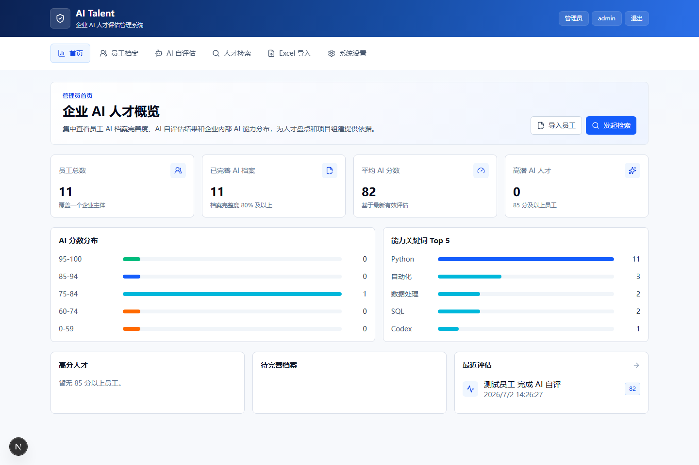
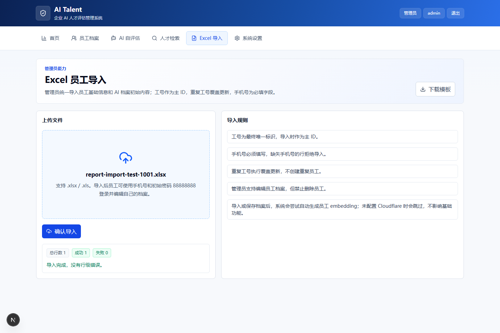
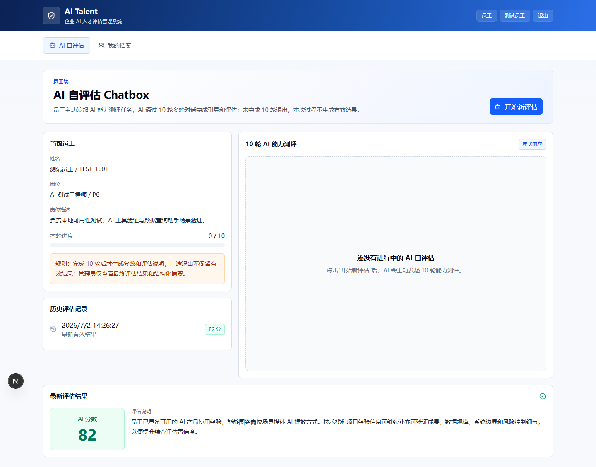
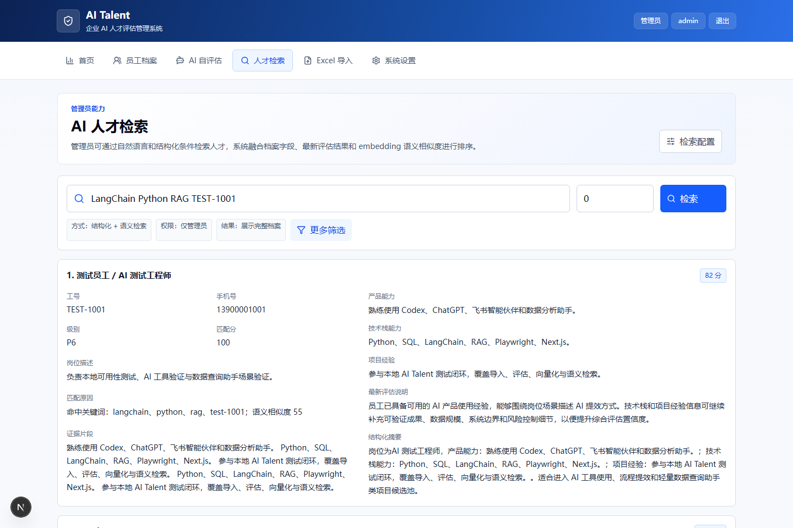
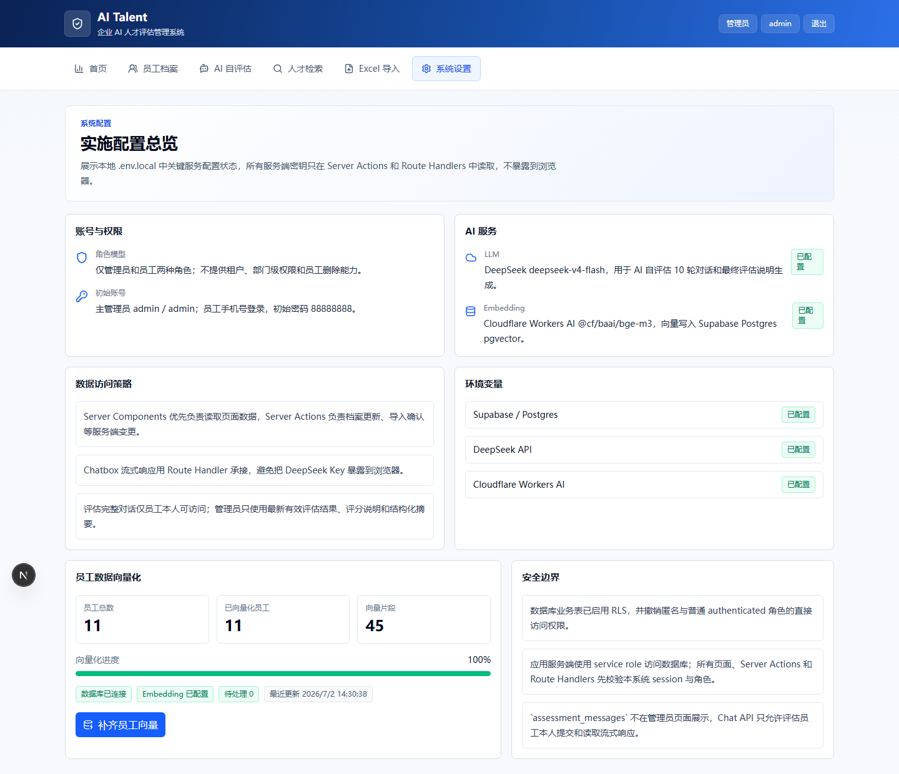

# AI Talent 测试报告 v1.0

生成时间：2026-07-02  
测试目标：完成本地项目发布前质量门禁，验证核心功能、接口、安全控制、数据库迁移和端到端可用性，达到发布到远程仓库/部署平台前的代码条件。

## 1. 测试结论

本轮发布前测试通过。当前代码满足发布到远程前的基础条件：

- 代码质量检查通过。
- 单元测试通过：5 个测试文件，12 个用例。
- 生产构建通过。
- 桌面端 E2E 通过：6 个业务用例。
- DeepSeek 真实 API smoke test 通过。
- npm audit 安全审查通过：0 个漏洞。
- Supabase migration 幂等执行通过。
- Playwright 临时报告和测试附件已加入 `.gitignore`，不会进入远程发布包。

## 2. 本轮修复项

| 类型 | 问题 | 处理结果 |
| --- | --- | --- |
| 测试覆盖 | Excel 模板下载接口未被 E2E 覆盖 | 新增管理员模板下载断言，校验文件名 `ai-talent-employee-template.xlsx` |
| 安全覆盖 | 员工直接访问管理员模板 API 未被覆盖 | 新增员工访问 `/api/import/template` 的重定向/拒绝断言 |
| 数据安全 | RLS 与权限撤销缺少自动化测试 | 新增 Vitest 静态测试，检查所有业务表启用 RLS 并撤销 `anon/authenticated` 权限 |
| 发布清洁度 | Playwright 报告与测试结果目录可能进入远程 | 更新 `.gitignore`，忽略 `playwright-report/`、`test-results/`、`tests/e2e/.artifacts/` |

## 3. 测试环境

| 项目 | 配置 |
| --- | --- |
| 应用 | Next.js App Router |
| 数据库 | Supabase Postgres + pgvector |
| AI Chat | Vercel AI SDK + DeepSeek |
| Embedding | Cloudflare Workers AI bge-m3；E2E 演示模式使用确定性 1024 维本地向量 |
| 测试运行 | Windows PowerShell，本地 `.env.local` |
| E2E 浏览器 | Desktop Chromium |
| 测试员工 | `TEST-1001`，手机号 `13900001001`，允许清理/覆盖 |

## 4. 自动化测试结果

| 命令 | 结果 | 说明 |
| --- | --- | --- |
| `npm run lint` | 通过 | ESLint 无错误 |
| `npm run test` | 通过 | 5 个测试文件，12 个用例通过 |
| `npm run build` | 通过 | Next.js 生产构建成功 |
| `npm run test:e2e` | 通过 | 6 个 Playwright 桌面端用例通过 |
| `npm run db:push` | 通过 | migration 可重复执行，已存在对象正常跳过 |
| `npm audit --registry=https://registry.npmjs.org/` | 通过 | `found 0 vulnerabilities` |

## 5. 真实业务截图与组件运行证据

以下截图均通过本地真实页面采集，使用管理员账号 `admin` 与测试员工 `TEST-1001` 完成业务链路验证。

| 截图 | 证明内容 |
| --- | --- |
| `01-admin-dashboard.png` | 管理员首页正常展示企业内部员工特征分布概览和核心指标 |
| `02-import-success.png` | 管理员 Excel 导入成功，页面展示总行数、成功数和失败数 |
| `03-employee-assessment-result.png` | 员工端可查看历史评估记录和最新 AI 分数、评估说明 |
| `04-admin-search-success.png` | 管理员人才检索可查到 `TEST-1001`，展示档案信息、匹配原因和评估摘要 |
| `05-settings-components.png` | 系统配置页展示 Supabase、DeepSeek、Cloudflare、向量化等组件运行状态 |

## 6. Vitest 覆盖范围

| 文件 | 覆盖内容 |
| --- | --- |
| `src/lib/import/excel.test.ts` | Excel 员工档案解析、必填校验、字段映射 |
| `src/lib/assessment/prompts.test.ts` | AI 评估 prompt、最终 JSON 解析、评分边界处理 |
| `src/lib/ai/embedding.test.ts` | 向量格式化、embedding 相关工具行为 |
| `src/lib/db/search.test.ts` | 结构化检索与语义检索融合排序逻辑 |
| `src/lib/db/security.test.ts` | RLS 启用、表权限撤销、向量匹配函数权限限制 |

## 7. Playwright E2E 覆盖范围

| 用例 | 结果 | 覆盖点 |
| --- | --- | --- |
| DeepSeek configuration smoke test | 通过 | 使用 `.env.local` 中 DeepSeek 参数发起真实 smoke 请求 |
| 管理员登录、核心页面导航和状态展示 | 通过 | 首页、员工档案、人才检索、Excel 导入、设置页 |
| 管理员下载模板、导入合法/非法员工 Excel | 通过 | 模板下载、行级错误、合法导入、`TEST-1001` 创建 |
| 测试员工登录、编辑档案、完成 10 轮 AI 自评估 | 通过 | 档案保存、Chatbox 流式响应、10 轮完成、结果入库 |
| 管理员检索员工且不可见完整 Chat | 通过 | 管理员检索、匹配原因、embedding 写入、完整对话不可见 |
| 员工不能访问管理员页面/API | 通过 | `/imports`、`/search`、`/settings`、`/api/import/template` 权限控制 |

## 8. 安全与权限检查

- 管理员可以查看员工档案、最新评估结果、结构化摘要和检索结果。
- 管理员不能查看员工完整 Chat 对话内容。
- 员工只能访问个人档案和个人 AI 自评估。
- 员工访问管理员页面会被重定向。
- 员工访问管理员模板 API 不会获得模板文件。
- Supabase 业务表均启用 RLS。
- `anon` 与 `authenticated` 被撤销业务表直接访问权限。
- `match_employee_embeddings` 仅授权 `service_role` 执行。
- 浏览器端不暴露 Supabase service role、DeepSeek Key、Cloudflare Token。

## 9. 发布前结论

当前代码已达到发布到远程的条件。建议下一步执行：

1. 将代码提交到 GitHub 远程仓库。
2. 在 Vercel 配置与本地 `.env.local` 对应的生产环境变量。
3. 在目标 Supabase 项目执行 migration。
4. 在生产环境执行一次 smoke 验证：管理员登录、员工导入、员工登录、10 轮评估、管理员检索。

## 10. 剩余注意事项

- E2E 仅验证桌面端，因为本应用当前明确不提供移动端。
- E2E 使用演示 AI 响应保证稳定；DeepSeek 使用 smoke test 验证真实连通性。
- Cloudflare embedding 生产环境需要配置真实账号与 Token；本地演示模式可用确定性向量跑通 pgvector 链路。
- `.env.local` 不应提交到远程，生产参数应配置在 Vercel Environment Variables。
